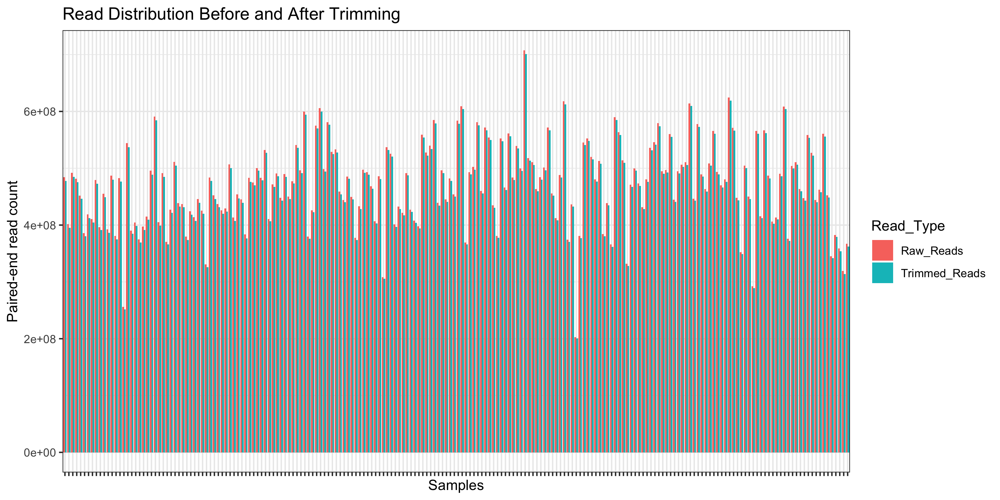

# Moroccan Immune Cell Atlas

This repository contains the code, workflows, and analysis related to the study:

**Single-cell multiomics reveals context-dependent immune variation in Moroccan Amazighs**

## Table of Contents

1. [Data Information](#data-information)
2. [Whole-Genome Sequencing Analysis](#whole-genome-sequencing-analysis)
3. [Global Ancestry](#global-ancestry)
4. [Single-Cell Demultiplexing](#single-cell-demultiplexing)
5. [scRNA-seq Analysis](#scrna-seq-analysis)
6. [scATAC-seq Analysis](#scatac-seq-analysis)
7. [Multi-omics Analysis](#multi-omics-analysis)
8. [Olink Analysis](#olink-analysis)

---

## Data Information

- Submit single-cell RNA-seq and scATAC-seq data to GEO.
- Submit Olink proteomics data to GEO.

---

## Whole-Genome Sequencing Analysis

Whole-genome sequencing (WGS) libraries were sequenced on the Illumina NovaSeq 6000 platform using a paired-end sequencing strategy.Raw sequencing reads 47,119,703,317 (101,387,322 -353,806,153) were subjected to quality control for trimming of low-quality bases and adaptor sequences using Trimmomatic. The cleaned reads 23,058,117,229 (100,307,069-350,464,742) were aligned to the GRCh38 human reference genome using BWA-MEM (0.7.15-r1140). The resulting SAM files were converted to BAM format and coordinate-sorted using SAMtools. Read group information was added with Picard, followed by duplicate marking using Picard MarkDuplicates to identify PCR duplicates.

To improve variant calling accuracy, base quality score recalibration (BQSR) was performed using the Genome Analysis Toolkit (GATK, v4.2.6.1) BaseRecalibrator with dbSNP (build 138) as the set of known variant sites, followed by recalibration of the aligned reads using ApplyBQSR. Variants were called independently for each sample using GATK HaplotypeCaller (v4.2.6.1) in GVCF mode to generate genomic VCF (gVCF) files suitable for cohort-based joint genotyping. The resulting gVCF files were compressed using BGZF and indexed with Tabix. 

For joint variant discovery, individual gVCFs were imported into chromosome-specific GenomicsDB databases using GATK GenomicsDBImport (v4.2.6.1). Joint genotyping was subsequently performed using GATK GenotypeGVCFs (v4.2.6.1) against the GRCh38 reference genome with dbSNP (build 138) supplied for variant annotation. This workflow produced a unified cohort-level VCF containing jointly genotyped germline variants across all samples while maintaining consistent genotype likelihood estimation and variant representation throughout the cohort.

### Commands used

## 1. Alignment

```bash
bwa mem -t 28 \
    reference.fasta \
    sample_R1.fastq.gz \
    sample_R2.fastq.gz \
    > sample.sam
```

## 2. Convert SAM to BAM

```bash
samtools view -@ 28 \
    -b \
    -o sample.bam \
    sample.sam
```

## 3. Sort BAM

```bash
samtools sort -@ 28 \
    -o sample.sorted.bam \
    sample.bam
```

## 4. Add Read Groups

```bash
picard AddOrReplaceReadGroups \
    I=sample.sorted.bam \
    O=sample.sorted.rg.bam \
    SORT_ORDER=coordinate \
    RGID=1 \
    RGLB=library \
    RGPL=ILLUMINA \
    RGPU=unit1 \
    RGSM=sample \
    RGCN=NYUAD
```

## 5. Index BAM

```bash
samtools index -@ 28 sample.sorted.rg.bam
```

## 6. Mark Duplicates

```bash
picard MarkDuplicates \
    I=sample.sorted.rg.bam \
    O=sample.sorted.rg.markDup.bam \
    M=sample_markDup_metrics.txt
```

## 7. Index Duplicate-marked BAM

```bash
samtools index -@ 28 sample.sorted.rg.markDup.bam
```

## 8. Base Quality Score Recalibration (BQSR)

```bash
gatk BaseRecalibrator \
    -R reference.fasta \
    -I sample.sorted.rg.markDup.bam \
    --known-sites dbsnp138.vcf \
    -O sample_recal_data.txt
```

## 9. Apply BQSR

```bash
gatk ApplyBQSR \
    -R reference.fasta \
    -I sample.sorted.rg.markDup.bam \
    --bqsr-recal-file sample_recal_data.txt \
    -O sample.recal.sorted.rg.markDup.bam
```

## 10. Variant Calling (GVCF)

```bash
gatk HaplotypeCaller \
    -R reference.fasta \
    -I sample.recal.sorted.rg.markDup.bam \
    --dbsnp dbsnp138.vcf \
    -ERC GVCF \
    -O sample.g.vcf
```

## 11. Compress GVCF & Index GVCF

```bash
bgzip sample.g.vcf
tabix sample.g.vcf.gz
```


## 12. Import GVCFs into GenomicsDB

```bash
gatk GenomicsDBImport \
    --sample-name-map sample_map.tsv \
    --genomicsdb-workspace-path genomicsdb/chr2 \
    --intervals chr2
```

## 13. Joint Genotyping

```bash
gatk GenotypeGVCFs \
    -R reference.fasta \
    -V gendb://genomicsdb/chr2 \
    --dbsnp dbsnp138.vcf \
    -O chr2.genotyped.vcf.gz
```


### Quality Control Summary


<p align="center">
  
</p>


---

## Global Ancestry

dadvavd

dwqdwqdwqd

qdwqdqwd

qwdwqdqwd

---

## Single-Cell Demultiplexing

Pool-specific gVCFs were generated from the large cohort of gVCF by first subsetting samples belonging to each sequencing pool, followed by variant filtering. 

Variants were retained only if they met the following criteria:

**(i)** biallelic single-nucleotide polymorphisms (SNPs)

**(ii)** minimum read depth (DP) of 10

**(iii)** minimum genotype quality (GQ) of 20.

Pool-specific filtered VCF along with the Cell Ranger output BAM file along with the corresponding filtered cell barcode list for each pooled 10x Genomics was used by cellsnp-lite(1.2.3)  to obtain allele-specific read matrices as first step of  demultiplexing. cellsnp-lite was was performed with default parameters except minimum minor allele frequency threshold of 0.05 and a minimum count threshold of 10. The resulting cell-by-SNP count matrices were written as compressed VCF outputs for each pool. Demultiplexing was performed to infer donor identity and detect doublets by genotype-based donor assignment using vireoSNP(0.5.9). The pool specific cell-by-SNP count matrices from cellsnp-lite and the pool-specific genotype VCF with default parameters was used by viero to assignment of singlet(single donars), doublet, and unassigned cell classifications for downstream seurat analysis.


### Commands used

Commands used for Demultiplexing is [here](scripts/singlecell-demultiplexing-workflow.smk)


---

## scRNA-seq Analysis

dadvavd

dwqdwqdwqd

qdwqdqwd

qwdwqdqwd

---

## scATAC-seq Analysis

dadvavd

dwqdwqdwqd

qdwqdqwd

qwdwqdqwd

---

## Multi-omics Analysis

dadvavd

dwqdwqdwqd

qdwqdqwd

qwdwqdqwd

---

## Olink Analysis

xaaad

---
